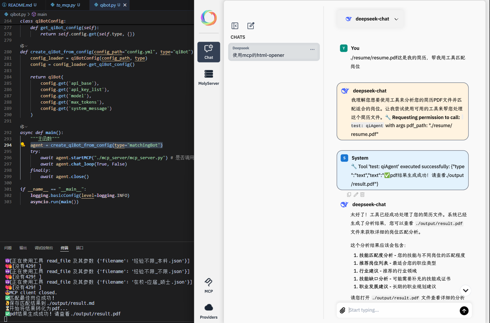

# qiAgent

作者：最后的轻语(qi)

小小说明：因为本文档有视频的缘故，所以推荐使用Typora来阅读文档！

## 项目简介

qiAgent 是一个基于 Python 的智能简历处理与岗位匹配助手。它能够自动提取 PDF 简历内容，结构化为 JSON 格式，并通过智能匹配算法为候选人推荐最合适的岗位。最终结果支持导出为 Markdown 和 PDF 格式，方便查看与分享。

## 为什么是它

茫茫岗位那个是最适合求职者的呢？一个接着一个的查看岗位信息，先不说自身与之匹不匹配，先看哪个呢？用什么策略看？还是全看？qiAgent帮您在众多岗位中匹配适合您的那个！

## 主要功能

- PDF 简历文本提取
- 简历内容结构化（JSON 格式）
- 岗位智能匹配
- 匹配结果导出为 Markdown 和 PDF
- 三个版本：原项目、mofa化、mcp化（支持moly）

## 主要模块说明

- `pdfprocessor.py`：负责 PDF 文本提取与 Markdown 转 PDF。
- `qibot.py`：支持调用MCP Tools、多轮对话的agent，可实现简历解析与岗位匹配智能 Bot。（流式输出还在路上）
- `mcp_server/mcp_server.py`：stdio式的MCP Server，支持查看指定目录的文件列表及内容。
- `classified_data/`：岗位分类数据，支持多种学历与经验组合。

## 目录结构

```
.
├── categorized_jobs.py        # 岗位分类脚本
├── config.yml                 # 配置文件
├── job_data_city.json         # 城市岗位数据
├── main.py                    # 主程序入口
├── pdfprocessor.py            # PDF 处理模块
├── qibot.py                   # 智能 Bot 逻辑
├── to_mcp.py                  # 项目MCP化
├── test.py                    # 测试脚本
├── output/                    # 输出目录（结果、简历 JSON 等）
├── resume/                    # 存放简历 PDF
├── classified_data/           # 分类后的岗位数据
├── mcp_server/                # MCP 服务端
└── to_mofa/                   # mofa实现版本
```

## 视频演示

原项目演示：

[<video src="./video/原项目.mp4"></video>](https://github.com/user-attachments/assets/c689e93d-2fa7-4d2b-bf02-b32b8902a331)

mofa化演示：

[<video src="./video/mofa化.mp4"></video>](https://github.com/user-attachments/assets/fd8ba870-35bb-4b90-8d36-39d98b401cef)

mcp化演示：

[<video src="./video/mcp化.mp4"></video>](https://github.com/user-attachments/assets/d20bd9f4-f9ab-4383-a4c5-ab0244520c2a)

## 快速开始

注意：本项目仅在win11系统进行过测试

### 1. uv环境

```powershell
# 使用powershell安装
powershell -ExecutionPolicy ByPass -c "irm https://astral.sh/uv/install.ps1 | iex"

# 验证安装
uv --version
```

### 2. 安装依赖

```bash
uv pip install -r requirements.txt
```
也可以下载我的环境[.venv](https://easylink.cc/1kzchi)

由于需要md转pdf，所以需要额外安装[wkhtmltox](https://wkhtmltopdf.org/downloads.html)至项目根目录。


### 3. 配置config.yml

填写所有的base_url和api_key_list，对应模型需支持Openai格式的API。

### 4. 准备简历文件

将你的简历 PDF 文件放入 `./resume/` 目录，并命名为 `resume.pdf`（或在 `main.py` 中修改路径）。

### 5. 运行主程序

```bash
uv run main.py
```

### 6. 查看结果

- 结构化简历信息：`./output/resume.json`
- 匹配岗位结果（Markdown）：`./output/result.md`
- 匹配岗位结果（PDF）：`./output/result.pdf`

## 配置说明

- `config.yml`：Bot 及服务相关配置。
- `job_data_city.json`：岗位与城市数据。

## 项目MCP化测试

```shell
uv run to_mcp.py # 开启streamableHttp类型的MCP Server
```

接着打开cherry studio配置：

 - 类型选择streamableHttp
 - URL填写：http://localhost:8000/mcp
 - 打开长时间运行模式
 - 超时设置为360
 - 保存打开即可

关于使用：
 - 告诉LLM相对本项目根目录的相对地址即可。
 - 输出产物在output文件夹里。

LLM 调用 MCP，MCP 再次调用另一个 MCP ...... 疑似俄罗斯套娃 (逃)

## moly调用

将下方json代码粘贴到moly的MCP中

```json
{
  "servers": {
    "test": {
      "url": "http://localhost:8000/mcp",
      "type": "streamable-http"
    }
  }
}
```


使用方法同cherry studio，上图调用成功！

## mofa化的项目

在./to_mofa/examples/qiAgent/readme.md

## 多轮对话（可调用MCP Tools）

```shell
uv run qibot.py # 测试
```

在里面可以实现多轮对话，可以选择是否使用MCP工具，详见代码末尾。

```
agent = create_qiBot_from_config(type="matchingBot")
```

在上述代码中可以修改agent的角色：
 - qiBot：日常化Bot
 - resumeBot：简历结构化Bot
 - matchingBot：岗位匹配与建议Bot
